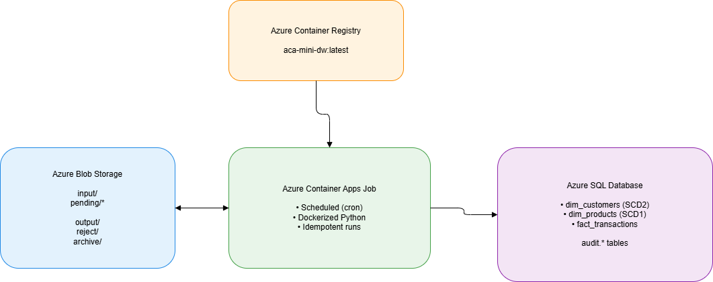

# ACA Mini Data Warehouse (Blob ➜ DQ ➜ SQL DW)

This project is a small, production-style **data warehouse ingestion pipeline** that runs inside an **Azure Container Apps Job** on a schedule (or manually). It ingests CSV files from Azure Blob Storage, applies **schema enforcement + data quality rules**, loads **dimensions and facts** into SQL Server, writes **reject outputs**, and logs everything into **audit tables**.

---

## What you’ll learn

1. Blob ingestion patterns (pending ➜ archive / reject)  
2. Schema enforcement (cast types, normalize column names)  
3. Data Quality (row-level quarantine + optional file rejection threshold)  
4. SCD Type 1 (Products)  
5. SCD Type 2 (Customers with history and `is_current`)  
6. Fact loading with surrogate key lookups (Transactions)  
7. Idempotency (skip already processed files by file hash)  
8. Observability (audit tables + per-run manifest outputs)  
9. Container + scheduled job execution (Azure Container Apps Job)



---
**One-Command Azure Resource Setup (Required)**
This project includes a PowerShell bootstrap script that creates all Azure resources needed to run the Mini Data Warehouse pipeline in one go.

**What This Script Creates**
Running the script provisions the following resources:
☁️ Azure Infrastructure

- Resource Group
- Azure Storage Account
  - input container (raw files)
  - output container (processed + rejects)
- Azure SQL Server
- Azure SQL Database (mini_dw)
- Azure Container Registry (ACR)
- Azure Container Apps Environment
- Azure Container Apps Job
  - Scheduled batch job (every 5 minutes)
  - Can also be triggered manually
 
**Data Platform Components**
- Builds and pushes the Docker image for the pipeline
- Runs database migrations (DDL)
- Uploads sample CSV files

Executes the pipeline end-to-end

**Prerequisites**
Before running the script, ensure you have:

- Azure CLI installed
 https://learn.microsoft.com/cli/azure/install-azure-cli
- Docker installed and running
- PowerShell (Windows / macOS / Linux)
- An Azure subscription
- Logged in to Azure CLI

**Edit the Variables (Top of Script)**
Update the following values:
```
$location = "southafricanorth"
$adminUser = "sqladminuser"
$adminPass = "Use-A-Strong-Passw0rd-Here!!"
$rg = "rg-aca-mini-dw"

```
**Run the Script**
Paste the full script below into PowerShell and run it:
```
# =======================
# EDIT THESE
# =======================
$location = "southafricanorth"
$adminUser = "sqladminuser"
$adminPass = "Use-A-Strong-Passw0rd-Here!!"
$rg = "rg-aca-mini-dw"

# =======================
# LOGIN + EXT
# =======================
az login | Out-Null
az extension add --name containerapp --upgrade | Out-Null
az provider register --namespace Microsoft.App | Out-Null
az provider register --namespace Microsoft.OperationalInsights | Out-Null

# Unique names
$prefix = "tc$((Get-Random -Maximum 99999))"
$storage = ("st" + $prefix).ToLower()
$acr = ("acr" + $prefix).ToLower()
$sqlServer = ("sql" + $prefix).ToLower()
$db = "mini_dw"
$env = "aca-env-$prefix"
$job = "aca-mini-dw-job-$prefix"

# =======================
# RG
# =======================
az group create -n $rg -l $location | Out-Null

# =======================
# STORAGE
# =======================
az storage account create -n $storage -g $rg -l $location --sku Standard_LRS --kind StorageV2 | Out-Null
az storage container create --name input  --account-name $storage --auth-mode login | Out-Null
az storage container create --name output --account-name $storage --auth-mode login | Out-Null

$storageConn = az storage account show-connection-string -n $storage -g $rg -o tsv

# =======================
# SQL SERVER + DB
# =======================
az sql server create -g $rg -l $location -n $sqlServer -u $adminUser -p $adminPass | Out-Null
az sql db create -g $rg -s $sqlServer -n $db --service-objective S0 | Out-Null

az sql server firewall-rule create -g $rg -s $sqlServer -n AllowAzureServices --start-ip-address 0.0.0.0 --end-ip-address 0.0.0.0 | Out-Null

$myip = (Invoke-RestMethod -Uri "https://api.ipify.org?format=json").ip
az sql server firewall-rule create -g $rg -s $sqlServer -n AllowMyIP --start-ip-address $myip --end-ip-address $myip | Out-Null

# =======================
# ACR
# =======================
az acr create -n $acr -g $rg --sku Basic | Out-Null

az acr build -r $acr -t aca-mini-dw:1 .

# =======================
# CONTAINER APPS ENV
# =======================
az containerapp env create -n $env -g $rg -l $location | Out-Null

$acrUser = az acr credential show -n $acr --query username -o tsv
$acrPass = az acr credential show -n $acr --query "passwords[0].value" -o tsv

$image = "$acr.azurecr.io/aca-mini-dw:1"
$sqlFqdn = "$sqlServer.database.windows.net"

az containerapp job create `
  -n $job -g $rg `
  --environment $env `
  --trigger-type Schedule `
  --cron-expression "*/5 * * * *" `
  --replica-timeout 1800 `
  --replica-retry-limit 1 `
  --image $image `
  --registry-server "$acr.azurecr.io" `
  --registry-username $acrUser `
  --registry-password $acrPass `
  --secrets storageconn="$storageConn" sqlpass="$adminPass" `
  --env-vars `
    AZURE_STORAGE_CONNECTION_STRING="secretref:storageconn" `
    INPUT_CONTAINER="input" `
    OUTPUT_CONTAINER="output" `
    SQL_SERVER="$sqlFqdn" `
    SQL_DATABASE="$db" `
    SQL_USER="$adminUser" `
    SQL_PASSWORD="secretref:sqlpass" `
    INIT_DB="true"

# Upload sample data and run once
az containerapp job start -n $job -g $rg | Out-Null

Write-Host "Deployment complete"
```

## Architecture

### Storage folders (input container)
- `pending/customers/`
- `pending/products/`
- `pending/transactions/`

### After processing
- If **success**: source files are moved to `archive/...`
- If **file rejected** (threshold breach / read error): moved to `reject/...`

### Output container artifacts
- `runs/<run_id>/<entity>/good.csv`
- `reject/<entity>/<run_id>/<file>_bad.csv` (bad rows + reject_reason)
- `runs/<run_id>/manifest.json` (summary of that run)

---

## SQL tables created

### Audit (observability)
- `audit.pipeline_run` – 1 row per pipeline run  
- `audit.file_ingestion` – 1 row per processed file (hash, counts, status)  
- `audit.dq_results` – per-rule failure counts  

### Dimensions
- `dbo.dim_products` (SCD1)  
- `dbo.dim_customers` (SCD2: history)  

### Fact
- `dbo.fact_transactions` (append, links to dims via surrogate keys)

---

## How the pipeline works (high-level)

For each entity in `config/settings.yml`:

1. List files in `pending/<entity>/`
2. For each file:
   - Compute file hash (idempotency)
   - Read CSV
   - Enforce schema (types + normalized column names)
   - Apply DQ rules:
     - Good rows continue
     - Bad rows quarantined into reject outputs
   - Optional: reject file if bad-row % > threshold
   - Load into SQL:
     - Products → SCD1 merge
     - Customers → SCD2 expire current + insert new current
     - Transactions → look up `customer_sk` + `product_sk`, reject missing dims, insert valid facts
   - Audit + archive

---

## Config files (YAML)

Each entity has its own YAML:
- `config/tables/customers.yml`
- `config/tables/products.yml`
- `config/tables/transactions.yml`

They define:
- input folder prefix
- schema (data types)
- keys and SCD/fact logic
- data quality rules and thresholds

Example DQ rule:
```yaml
dq:
  mode: quarantine_rows
  reject_threshold_pct: 30
  rules:
    - name: email_format
      type: regex
      column: email
      pattern: "^[^@\\s]+@[^@\\s]+\\.[^@\\s]+$"
```
**Running the job (manual trigger)**
```
az containerapp job start -n $job -g $rg | Out-Null
Start-Sleep -Seconds 5

$exec = az containerapp job execution list -n $job -g $rg --query "[0].name" -o tsv

az containerapp job logs show `
  -n $job `
  -g $rg `
  --execution $exec `
  --container $job `
  --follow

```
Note: the --container name is usually the same as your job name (check az containerapp job show).

**Uploading test data (CLI) — Batch 1**
**1) Customers (includes invalid emails to test reject rows)**
```
$customers = @"
customer_id,name,email,country,updated_at
1,Alice,alice@gmail.com,South Africa,2026-02-01T10:00:00Z
2,Bongani,bongani@gmail.com,South Africa,2026-02-01T11:00:00Z
3,Chipo,chipo_at_mail.com,Zimbabwe,2026-02-01T12:00:00Z
4,David,david@gmail.com,South Africa,2026-02-01T13:00:00Z
5,Elena,elena_at_mail.com,South Africa,2026-02-01T14:00:00Z
6,Farai,farai@yahoo.com,Zimbabwe,2026-02-01T15:00:00Z
"@

$tmp = New-TemporaryFile
$customers | Set-Content $tmp -Encoding utf8

az storage blob upload `
  --account-name $storage `
  --container-name input `
  --name "pending/customers/customers_batch1.csv" `
  --file $tmp `
  --auth-mode login `
  --overwrite

Remove-Item $tmp

```
Expected:
2 invalid emails → rejected rows output
4 valid rows → loaded to dbo.dim_customers

**2) Products**
```
$products = @"
product_id,product_name,category,price,updated_at
10,Milk,Dairy,18.50,2026-02-01T10:00:00Z
11,Bread,Bakery,15.00,2026-02-01T10:05:00Z
12,Rice,Grains,39.99,2026-02-01T10:10:00Z
13,Chicken,Meat,24.00,2026-02-01T10:15:00Z
"@

$tmp = New-TemporaryFile
$products | Set-Content $tmp -Encoding utf8

az storage blob upload `
  --account-name $storage `
  --container-name input `
  --name "pending/products/products_batch1.csv" `
  --file $tmp `
  --auth-mode login `
  --overwrite

Remove-Item $tmp

```
Expected:
All rows load into dbo.dim_products (SCD1)

**3) Transactions (includes missing dims to test reject fact rows)**
```
$transactions = @"
transaction_id,customer_id,product_id,quantity,amount,currency,transaction_ts
tx-001,1,10,2,37.00,ZAR,2026-02-01T13:00:00Z
tx-002,2,11,1,15.00,ZAR,2026-02-01T13:05:00Z
tx-003,4,12,1,39.99,ZAR,2026-02-01T13:10:00Z
tx-004,6,13,3,72.00,ZAR,2026-02-01T13:15:00Z
tx-005,999,10,1,18.50,ZAR,2026-02-01T13:20:00Z
"@

$tmp = New-TemporaryFile
$transactions | Set-Content $tmp -Encoding utf8

az storage blob upload `
  --account-name $storage `
  --container-name input `
  --name "pending/transactions/transactions_batch1.csv" `
  --file $tmp `
  --auth-mode login `
  --overwrite

Remove-Item $tmp

```
Expected:
tx-005 rejected because customer 999 doesn’t exist in dimension
other rows load into dbo.fact_transactions

**Testing SCD Type 2 (Customers) — Batch 2 (updates + new customer)**

Create a second customers file that:
changes Alice’s email
changes Farai’s country
adds a new customer
```
$customers2 = @"
customer_id,name,email,country,updated_at
1,Alice,alice.new@gmail.com,South Africa,2026-02-02T10:00:00Z
2,Bongani,bongani@gmail.com,South Africa,2026-02-02T11:00:00Z
6,Farai,farai@yahoo.com,South Africa,2026-02-02T15:00:00Z
7,Gugu,gugu@gmail.com,South Africa,2026-02-02T16:00:00Z
"@

$tmp = New-TemporaryFile
$customers2 | Set-Content $tmp -Encoding utf8

az storage blob upload `
  --account-name $storage `
  --container-name input `
  --name "pending/customers/customers_batch2.csv" `
  --file $tmp `
  --auth-mode login `
  --overwrite

Remove-Item $tmp

```
Expected in dbo.dim_customers:
- For customer_id=1: old row expired (is_current=0), new row inserted (is_current=1)
- For customer_id=6: same behavior if country changed
- customer_id=7 inserted new

**Notes / Gotchas**
**1) Idempotency**
If you upload the exact same file contents again (same hash), the pipeline will skip it as already processed.

**2) Reject threshold**
If you set reject_threshold_pct and bad rows exceed it, the entire file is rejected and not loaded.

**3) Facts require dims**
Transactions must map to current customer_sk and product_sk. If a dim doesn’t exist, that transaction row is quarantined.
